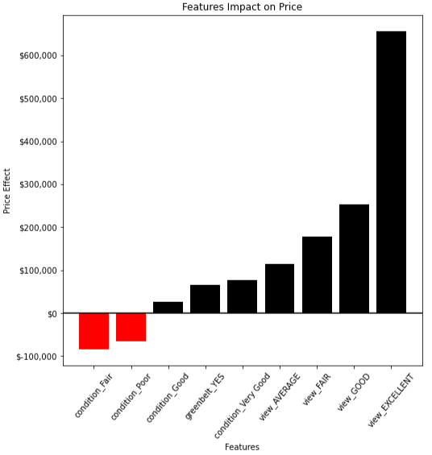

# Kings County Real Estate Analysis

Kings County - A beautiful place to live!

## Project Overview
A Seattle real estate brokerage wants to expand their services to developers by offering "state of the art" linear regression price prediction model model. This model directs shows the price effects of the size, location, and various property features on residential, single family unitys. Having accurate price forecasting is valuable to developers who need to know what and where to build. The model and related files, contained in this repository, include a multi-variable linear regression model to examine the relationship between the features and accounts for 72% of the variance in price. In other words, the model can predict the price of a home within ~$200k (RMSE) by considering approximately 25 property features. 

## Table of Contents TOC
[Business Case](#business-case) 
[Data Understanding](#data-understanding) 
[Data Preparation](#data-preparation) 
[Modeling](#modeling) 
[Evaluation](#evaluation) 
[Key Findings](#key-findings) 
[Summary](#summary) 
[Github Repository](#github-repository) 

## Business Case
Since 2010, there have been 105,207 new units built in the Seattle city limits, represented a 34% increase, according to . This has kept pace with the 189,040 additional people, or 31% increase during the same period. Despite this, Kings County continues to have a strong real estate market, with increasing need for house. But real estate developers need to know where and what to build well in advance of breaking ground. A price prediction model would help. Accounting for not only square footage and zip code, developers would like information on bedrooms and bathrooms, views, and other property features.  
 [return to TOC](#table-of-contents-TOC)

## Data Understanding
To aid real estate developers in their quest to know what and where to build, the first step is to focus on the size and location of the home. We know that builders and buyers often think about homes in terms of price per square foot, a simple linear expression. We also know that this increases or decreases by neighborhood. We can factor in zip code, and other property features as individual categorical features with some coefficient determining the effect on price.

### Source Data
This project will use the publically available [King County House Sales](data/kc_house_data.csv) dataset, which can be found  in the `data` folder in this GitHub repository. A complete description of the column names can be found in [`column_names.md`](data/column_names.md) in the same folder. The data set consists of characterists about houses that have been sold in Kings County for fiscal year 2021-2022. They contain about 25 data columns. Some of the key features are shown below

* `price`
* `sqft_living`
* `addess`
* `grade`
* `condition`
* `date`
* `view`

### Data Approach
In order to aid real estate developers in their quest to know what and where to build, the first step is to focus on the size and location of the home. Anecodotally, we know that builders and buyers often think about homes in terms of price per square foot, a simple linear expression. We also know that this increases or decreases by neighborhood. A linear regression model incorporating both of these factors is appropriate for the analysis we're providing.

We will achieve this with our linear regression models using an iterative approach. We will start with a simple, single variable model and build more complexity with additional variables. The sales price would be our target, or depedent variable. From there, we quantify the impact of other features (bedrooms, baths, or condition) on the price.
 [return to TOC](#table-of-contents-TOC)

## Data Preparation

### Data Import 
To get started we import the CSV file in a pandas dataframe. It's got 30,155 entries with 25 columns. We see both numeric continuous, numeric discrete, and categorical data.

### Data Cleaning
Next we removed or clean a variety of data points. This includes handling null values as well as data the doesn't seem right. We consider square footage, lot square footage, above ground square footage, bedroom and bathroom combos, and addresses that do not appear to have a Kings County Zipcode.

#### Drop Null Values (removed 44 entries)
Of the 30,155 entries, there were 44 entries with NUll values in any of the columns. Because it's such a small percentage (< .01%) we'll discard these rows.

#### Small Square Footages (removed 1 entry)
Of the now 30,111 entries, we have 1 entry where `sqft_living` is less than 100 sq. ft. According to the listing, it's a 4 bed, 4 bath house of 3 sq.ft. house. This isn't right. We can delete that.

#### Small Lot Square Footages (removed 0 entries)
We inspected homes with `sqft_lot` less than 500 sq. ft. It turns out there are quite a few homes on small lots but many are multistory. These entries look real. They could be small row houses, condos, or something multi-story not requiring large lots. We'll leave these entries.

#### Small Above Square Footages (removed 0 entries)
We inspected homes with `sqft_above` less than 300 sq. ft. There are 4 entries and and they look okay. Probably a small studio apartment or something. We removed none.

#### Bedrooms and Bathrooms - Less than 1 (removed 21 entries)
We inspected homes with less than 1 bed and 1 bath to see if these looked suspicious. There were 21 entries. Based on the `column_names` document. To make sure these weren't cabins, we also checked there `grade` cateogry and realized they were mostely all average to good (7-8). This seemed suspicious so they were deleted.

#### Addresses with "Washington" (removed 902 entries)
Because we do care about zipcodes and neighborhoods, we want to be sure that our data is based on Kings County info. To do this, we created a function to check to see if the word "Washington" appeared in the address. And, there are apparently 902 entries that do not contain that word. A spot check on these reveals data from out of state. So, we deleted this as well. @e are now down to 29,187 from 30,155, the majority of those from non-Washington state entries.

### Feature Engineering 
#### ZipCode
Because we do care about zip codes, we want to extract the zipcodes from the address and make a new column with justt those 5 digits as integers (later, we will use one-hot encoding to convert these to columns). So we made a function that will extract the five digits of where ever the numbers of the zipcode are located in the address. We then created a new column called `zipcode`. We have 77 different zipcodes.

#### Grade
The grade column will be considered later. This is currently a string containing a number 1-12 and a qualititative assessment, ("7 average", for ex). We will convert this to just an integer of the number. So from "7 average" to "7". This column is called `intgrade`

#### Year
To understand how the age of the house effects price we will include this information. To make a linear relationship more clear, we will subtract this number by 1900. So the range will be 0-120 in terms of recency. A `yr_built_transform` column will be created for this. 

#### Sales Month
Sometimes we here that spring is a popular time to sell homes, but does that translate to price? To check this, let's add a column called `sales_month`.

### Outliers Reduction 
Once the data has been cleaned it was important to inspect outliers that much impact the accuract of our model.

#### Mansions - Large Homes (288 entries removed)
A quick inspection of the `sqft_living` data reveals a slight left_skew, meaning a tail extending to the larger square foot homes. The 99th percentile home is 5190 sq. ft. The 75th percentil home is 2640 sq.ft. This is a big difference, so we removed them from our set. This reduces our entries from 29,187 to 28,899, or 288 entries.

#### Pricey Homes (173 entries removed)
A quick inspection of the `price` data reveals a slight left_skew, meaning a tail extending to the more expensive homes. The 99th percentile home is 4.3M. The 75th percentil home is 1.3M. We'll go ahead and get rid of the 1% that's higher than 4.3M. This reduces our entries from 28,899 to 28,726, or 173 entries.
 [return to TOC](#table-of-contents-TOC)

The approach is to begin with a simple, basic linear regression model to describe sq.ft vs price. From here, we will then consider zipcode. The zipcodes will be one-hot encoded, which means all 77 zipcodes will be given a column in the dataframe. 1 of 77 entry will be given a 1 to represent a house in that zipcode. The other zipcodes will be 0. After that model, we included additional features to quantify their effect.

## Modeling

### Baseline Model
#### Technique
So, first we're going to create a model using the Ordinary Linear Squares (OLS) method. The endogenous variable will be `price` and the exogenous, or independent variable, will be `sqft_living`.

#### Results
When we do this, we get a model that explains variance of 39.3% of the variance, but with high confidence that are coefficients are accurate. We get $447/ sq. ft. + $115,000. When we plot this line as a best_fit against all of the listings on a graph of `price` vs `sqft_living` we get the following graph

What we see here is interesting. Homes sell for almost $500/sq. ft. So a 2,000 sq. ft home sales for nearly 1M USD. A 4,000 sq.ft. home sales for nearly 2M USD. At a minimum, there seems to be a $115,000 premium for having a home in Kings County.

### Zipcodes
Now that we have a simple model with a straightforward linear relationship, let's begin to make it more complex. 

#### Technique
We're still going to use the OLS method, but we're going to add zipcodes to the set with one-hot encoding for zipcode data. We now have an exogenous set with roughly 78 variables. We would have more but we dropped zipcode 98070 from our analysis because it had the least impact and was thereby closer to the averge.

#### Results
What we found is a model accounting for 68.4% of all variance. 

Using the standard alpha of 0.05 to evaluate statistical significance, Coefficients for sqft_living and most of our zipcodes are statistically significant. Our baseline zipcode is 98070. It seems that relative to our baseline, the zipcodes do have a statistically significant effect on price, except for zipcodes 98224, 98113, 98118, 98027, and 98011). So... 

According to the model, houses are selling at approximately $374/sq. ft. with a coefficients for the intercept is $295,200. That means that, when not accounting for square footage or zipcode, you could assume a house will sell for $295,200.

But once you factor in the zipcodes, they do have an impact on price. In fact, our model shows noticeable impact on price. To illustrate this point we've graphed two high impact zipcodes.

You can see that there is a significant difference between zip codes. 98004 homes are approximately 1.3M more than a typical zip code (in this case 98070). Zip code 98023 homes are approximately 445k less than the homes in 98070. We've also seen the price per square foot decrease. As we include the neigborhood, we see other things effect price. This makes sense

### Additional Features - Linear
Now that we have a model that achieves what we set out to do. We're going to look at other factors like bathroom and bedroom to see any effect on price. We'll also look at other factors like views, conditions, grade, condition, and other perks to see if we can tease out any additional effects.

To include the sales data as categorical, each month is one hot encoded, and then included in the set for analysis.

#### Additional Numeric Variables - Not Considered in Model
To determine if other numerical variables should be added, the variables were plotted against eachother using an iterative loop, and really no linear relationship was found with potentially finding collinearity with `sqft_living`. The only variable that shows possible linearity, and it's faint, is the `yr_built`. This will be included in the model later. 

## Evaluation
Now that we have completed the model, let's review some of the statistics.

### Linear Regression Results
#### Adjusted R-Squared
Our Adjusted R-Square is now showing a value of 72.7% of all variance accounted for. This is better, but 5% increase seems modest when accounting for many additional variables.

#### Statistical Significant Coefficients
Using the standard alpha of 0.05, the results show coefficients for sqft_living and most of our zipcodes are statistically significant. Our baseline zipcode is 98070. It seems that relative to our baseline, the zipcodes do have a statistically significant effect on price, except for zipcodes 98014, 98019, 98045, 98050, 98056, 98059, 98108, 98118, 98126, 98133, 982242). So...

#### Intercepts and Variables
Our coefficient for the intercept is significanty significant for an alpha of .05. According to the model, houses are selling at approximately $355/sq. ft. The coefficients for the intercept is 51,930. That means that, when not accounting for square footage or zipcode, you could assume a house will sell for 51,930. 

###  Error Testing
Now that we have this amazing model, we're going to perform some error testing to see if the results we get are accurate and also, well, still linear. So, we're going to examine collinearity, Mean Absolute Error (MAE) Testing vs Root Mean Squared Error (RMSE), homoscedasticity, and Goldfeld Quandt testing.

### Collinearity
To examine collinearity, we're going to look at a seagram heatmap of a correlation matrix between a number of the additional features we looked at.

From here we can see the majority of our features show very little correlation. The two areas that do show it are `view_EXCELLENT` correlates slightly with `waterfront`. This makes sense because it's intuitive that if you live on the water, chances are you have an excellent view. So, based on that logic, I will remove the `waterfront` variable to avoid this.

The other correlated variables are `yr_built_transform` with `sqft_living`. It seems as though houses that were built more recently are larger than older houses. This makes sense, and we will remove `yr_built_transform` because, well, we can't really remove `sqft_living`.

### Mean Absolute Error (MAE) Testing vs Root Mean Squared Error (RMSE)
#### Mean Absolute Erro (MAE)
The next item to examine is MAE vs RMSE. This analysis will tell us the error in our model. Mean Absolute Error is a means to evaluate how "far off" or inaccurate a model may be. It sums the absolute value of all of the errors and takes the mean. When we calculate the MAE for our model, we get $212,000. 

#### Mean Absolute Error (RMSE) Root Mean Squared Error
The other method of determining error is to take the square root of all of "the average squared difference between the estimated values and the actual values" (according to Wikipedia). This is another method to analyze residuals of a model and determine how much error exists. In our model, the RMSE is 323,000, which is larger than the MAE. 

Because the RMSE > MAE, there may be more outliers in our data even though we eliminated the top 1% for square footage and price..

### Homoscedasticity
Homoscedasticity is the observation that the magnitude of the errors (or residuals) is the same no matter what the input, or independent variable is. The most effective way to observe this is by plotting the residuals against the predicted values. Homoscedasticity will result in a straight line around the max residuals. Heteroscedasticity will result in a curved line around the max residuals.

The plot below shows our residuals vs the predicted. 

We do not see great homoscedasticity. This would improve possibly if we removed some outliers.

### Goldfeld-Qaundt
The Goldfeld_Qaundy test is a way to reject the fact that are data is Homoscedastic. If we can reject this, than we know for sure it is Heteroscedastic. When we run it, we see our p-value is 0.08 greater than 0.05. This means we are not able to reject the null hypothesis which states our error terms are homoscedastic.

This further validates the assumption of homoscedasticity of our residuals.

## Results Discussion
We discussed previously how, in general, Kings County had on a price of 447/sq.ft County wide.

After we accounted for zipcode, we saw quite a shift depending on where our home was located.

### Error and Accuracy
Our model has the following has an error of approximately $212,000. Our Adjusted R-Square is now showing a value of 72.4% of all variance accounted for.

### Statistical Significance
Using the standard alpha of 0.05 to evaluate statistical significance:

Coefficients for sqft_living and most of our zipcodes are statistically significant. Our baseline zipcode is 98070. It seems that relative to our baseline, the zipcodes do have a statistically significant effect on price, except for zipcodes 98014, 98019, 98045, 98050, 98056, 98059, 98065, 98118, 98126, 98133, 98155, 98224). So...

## Key Findings
Our model was able to predict the 72% of the variance in price, with an approximate error of $212,000. Some of the key findings are shown below.

#### Bedrooms & Bathrooms
To examine bedrooms and bathrooms, let's first look isolate bedrooms and bedrooms and their effect on price. We will do that with two charts. First, let's look at a few stats for the number of bedrooms and bathrooms built.

We can see here that the median home has 3 beds and 2.5 baths, which is interesting. Let's look at the overall relationship between bedrooms and bathrooms and sales price.

Interesting. It looks like there isn't a linear relationship. In fact, the price seems to peak around 5 bedrooms and 4.5 baths. After this, the price either drops or flattens out. This doesn't look like a great candidate for a linear relationship but something to note - building more than 5 bedrooms or 4.5 baths may not result in a price increase.

#### Closing Date
Realtors tell us there is a "season", usually in the spring, that's the best time to list a home. Let's see if that data plays out and if theres a linear relationship. When we plot the closing month vs the sales price, this is what we get.

So, the realtors are on to something... prices peak in the spring, when the sales close in April and May. This is not a linear relationship but fairly compelling data - nearly 200K difference between April and January. We can't include it as linear but I will include it categorically.

 [return to TOC](#table-of-contents-TOC)

### Impacts
According to the model, houses are selling at approximately $357/sq. ft, which is less than our original estimate, which showed homes selling at approximately $447,000. This means that as we factored other variables, that effect of square footage diminished.

We can see here, that home would have to be about 2500 sq. ft. to sell for the same amount that a 2,000 sq.ft. home would have to in our previous analyis. Why? Because now that we account for other factors (zipcode, additional features) the value of square footage has gone down.

The coefficients for the intercept is 112,000. That means that, when not accounting for square footage or zipcode, you could assume a house will sell for 112,000.

Additionally, zipcodes have a large impact.

The zipcodes with the largest effect are 98004, 98005, 98033, 98039, and 98040. Zipcode 98010, 98001, 98003, 98023, and 98092 have the most negative effect on pricing.

### Additional Feature Impacts

There are additional features with price impact as follows.

An excellent view can really boost a property value, and poor or fair condition can hurt it, but both of these factors are less than the zipcode impact (remember, $1.3M boost).

## Summary
We were able to create a model that account for a model with reasonabale accuracy. 

We confirmed that sqaure footage and zip code are the two largest factors when pricing a home.

A linear regression model built iteratively was able to account for 72% of the variance in the housing price, with an average error of approximately $212,000.

### Recommendations

#### Zipcode 
Price increase with zipcode should be factored into the price of land.

#### Don't over build bedrooms and bathrooms 
There appears to be a threshold on price increases. More than 5 bedrooms and 4.5 bathrooms does not increase price.

#### Views 
A good or excellent view and increase the price by mroe than 100K. Factor this into a decision when buy property on designing homes.
 [return to TOC](#table-of-contents-TOC)

## Github Repository

To execute this project, a github repository is utilized for public viewing and collaboration

You can see the following files stored in the github repository.

* *PDFs* - Folder containing pdf files below 
    * `Kings County Real Estate Presentation` - Non-technical presentation of the Analysis
    * `Kings County Real Estate Analysis` - complete Jupyter Python Notebook in pdf form
    * `README` - README file converted to PDF
            
* *Images* - Folder containing the image files used in the Notebook, Presentation, and README file 

* *data* - Folder containg the source data files
    * `kc_house_data.csv` - Kings County Housing Data Set
    * `column_names.md` - file explaining the column names  

* *Contributing.md* - Folder containg instruction for how to contribute to Learn.co

* *README.md* - the currently file you're reading with descriptions about the coding file

* *canvas.txt* - a Canvas text file

* *gitignore.txt* - git ignore file 

* *kings_county_real_estate_analysis.ipynb* - Notebook with Python analysis

 [return to TOC](#table-of-contents-TOC)

